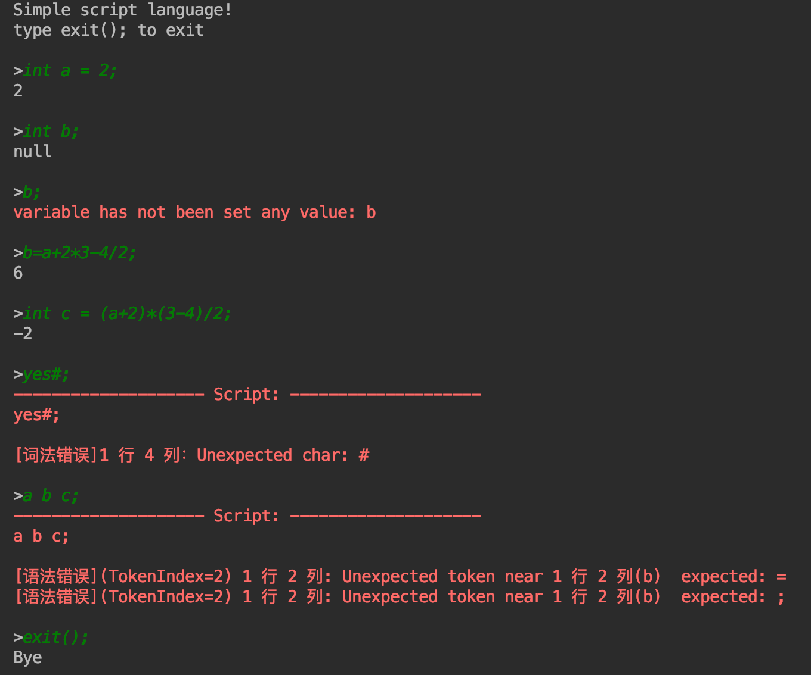

简单整型脚本 产生式：
```
[script]         -> [stmt]+
[stmt]           -> [intDeclare]
[stmt]           -> [expressionStmt]
[stmt]           -> [assignStmt]
[intDeclare]     -> INT ID [intDecRight]
[intDecRight]    -> '=' [additive] ';'
[intDecRight]    -> ';'
[additive]       -> [multiplicative] ( '+'|'-' [multiplicative] )*
[multiplicative] -> [primary] ( '*'|'/' [primary] )*
[primary]        -> IntLiteral | ID | '(' additive ')'
[expressionStmt] -> [additive] ';'
[assignStmt]     -> ID '=' [additive] ';'
```
[词法分析器 Lexer.java](Lexer.java)  
[语法分析器 Parser.java](Parser.java)  
[脚本执行器 IntScript.java](IntScript.java)  

see also: [RichardGong/PlayWithCompiler](https://github.com/RichardGong/PlayWithCompiler/tree/a9fd83f084e35be93e949c0d2f4ed3859b92f80e/lab/craft)

<hr>

# 基本概念复习

PPT：  
https://github.com/YouthLin/SNL-Compiler/tree/master/%E8%AF%BE%E4%BB%B6

# 文法 
文法 G 是一个四元组 G=(N, T, P, S)，其中：  
N 是非终极符(Non-Terminals)的有限集合，不可为空；  
T 是终极符号(Terminals)的有限集合，不可为空。
  且 N ∩ T = ∅ (通常用 V 表示 N ∪ T);  
S 是文法开始符号(Start), 且 S ∈ N;  
P 是产生式(Production)的有限集合, 产生式的一般形式是 α → β 
  读作" α 产生出 β ", 或" α 推出 β ". α, β ∈ V*,  
  α 称为左部，不可为空, β 称为右部。
  
## 推导与规约
- 直接推导 =>  
    a -> b 是一条产生式，x,y 是文法中任意符号，若有符号串v, w 满足：
    v=xay, w=xby, 则说 v (应用规则 a->b )直接产生 w, 
    或说 w 是 v 的直接推导，或说 v 是 w 的直接规约，记作 v=>w.  
- =>+  若有 v=w0 => w1 => w2 => ... => wn=w n>0 
    则称 v 推导出 w 或称 w 规约出 v, 记作 v =>+ w  
- =>*  若有 v =>+ w 或 v = w, 则记作 v =>* w

## 句型与句子，语言
- 如果有 S =>* a, S 是文法 G 的开始符，a ∈ V* 则称 a 是 G 的句型  
- 如果有 S =>+ a, S 是文法 G 的开始符，a 属于 T* 则称 a 是 G 的句子
- 语言 L(G) = {a | S =>+ a, a ∈ T*} 即 文法 G 的所有句子的集合

## 文法类型 Chomsky 乔姆斯基
G=(N,T,P,S)的每个产生式 a -> b 是这样一种结构：
1) a ∈ V* 且至少含有一个 N, b ∈ V* 则 G 是 **0 型文法** 或称 **短语文法**
2) |b| >= |a|, 仅仅 S -> ε 除外 则称 G 是 **1 型文法** 或称 **上下文有关文法**
3) a ∈ N, b ∈ V*, 则称 G 是 **2 型文法** 或称 **上下文无关文法**
4) 或 P 中每个产生式的形式都是 A -> aB 或 A -> a, A,B ∈ N, a ∈ T*, 则称 G 是 **3 型文法** 或称 **正则文法**

## 上下文无关文法与语法树
语法树：一种表示句型推导的直观工具。  
定义：
给定文法 G=(N,T,P,S), 对于 G 的任何句型都能构造与之关联的语法树，这棵树满足下列 4 个条件：
1) 每个结点都有一个标记，此标记是 V 中的一个符号
2) 根的标记是 S
3) 若已结点 node(标记为 A) 至少有一个除自己之外的子孙，则 A ∈ N
4) 如果结点 node(A) 的直接子孙从左到右的次序是 n1,n2,...,nk, 
   其标记分别为 A1,A2,...,Ak, 那么 A->A1,A2,...,Ak 一定是 P 中的产生式
   
## 最左(右)推导，规范句型
如果在推导 a=>b 都是对 a 中的最左(右)非终极符使用产生式替换，则称这种推导为**最左(右)推导**。  
最右推导是**规范推导**。  
由规范推导产生的句型称为**规范句型**。

二义性文法：如果一个文法的某个句子对应两棵不同的语法树，或某个句子存在两个不同的最左(右)推导，则说这个文法是二义的。

特型产生式：U -> U  
无用产生式：没有一个句子的推导中用得到的  
空产生式：A -> ε

# 语法分析的方法

## 自顶向下的语法分析

自顶向下语法分析是从文法开始符开始，尽可能找到一个合适的推导，使之生成源程序的过程。  
关键问题：
- 选择哪个非终极符进行推导  
  为了方便，选择最左的非终极符
- 对于选定的非终极符 A 使用哪条产生式进行推导  
  根据预测符集Predict（A -> γ）选择  
  Predict(A -> γ) = {a | S =>+ αAβ => αγβ =>+ αaβ' , α ∈ T*}

### 三个集合
First(α)  
Follow(A)  
Predict(A -> α)  

确定的自顶向下分析条件：  
同一个非终极符的任意两条产生式的预测符集不相交

左递归与左公共前缀  
左公共前缀：提取左公共前缀生成新的非终极符  
直接左递归：变成右递归  
间接左递归：非终极符排序消元法  

### 递归下降语法分析
依赖产生式及其预测符集

### LL(1) 语法分析
构造 LL(1) 分析表

## 自底向上语法分析

短语
简单短语
句柄

前缀
规范前缀
规范活前缀
规约规范活前缀

### 简单优先分析
优先关系矩阵

### LR 分析
LR(0) 
LR(1) 
LALR(1)

